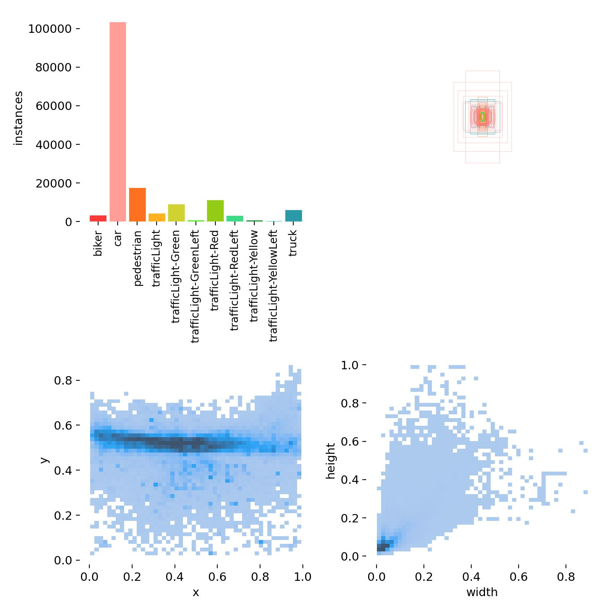
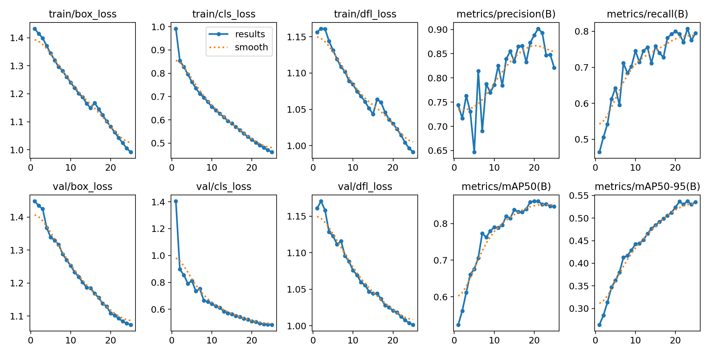
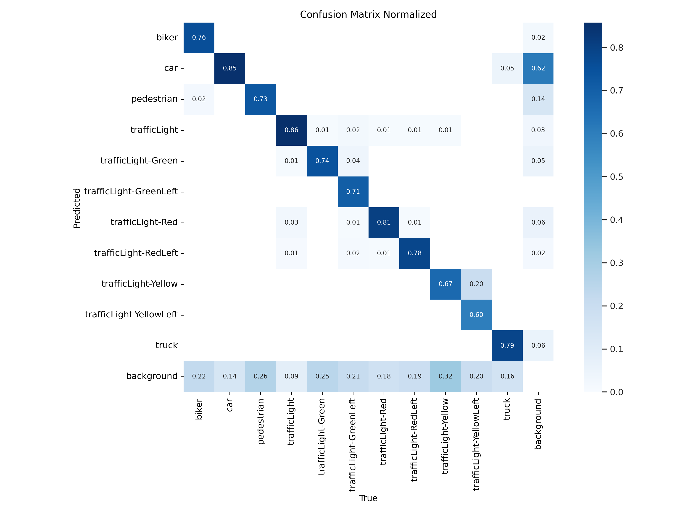
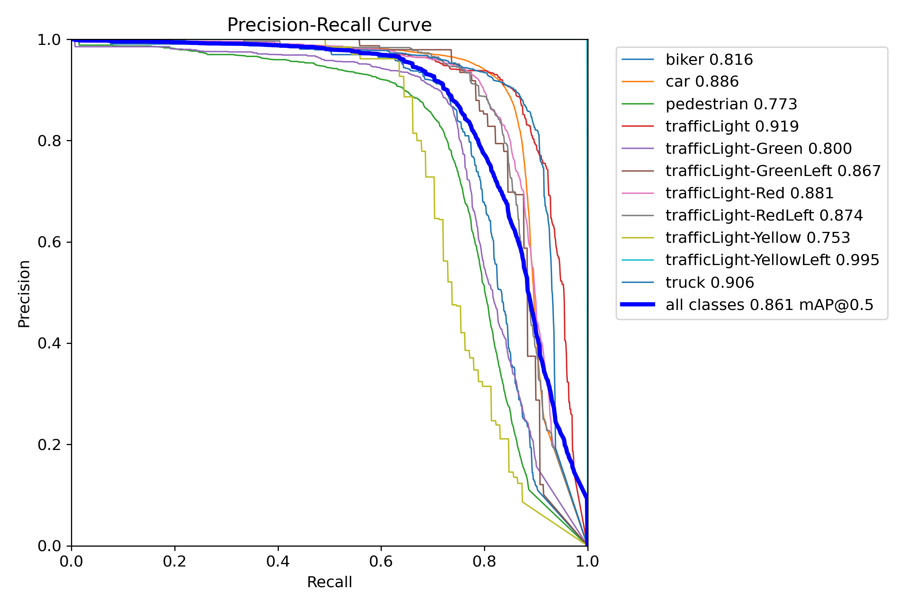
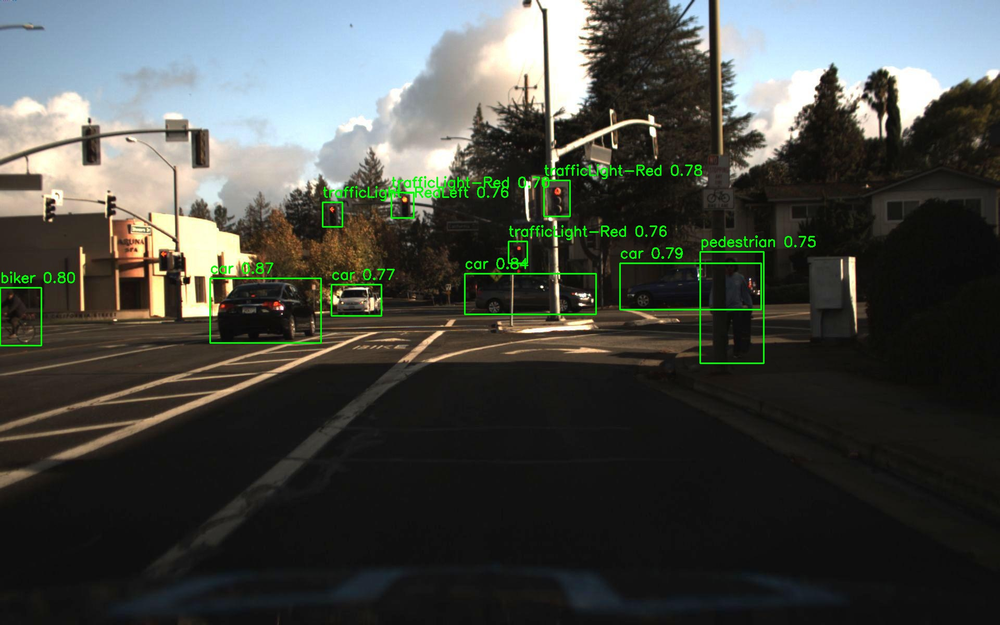
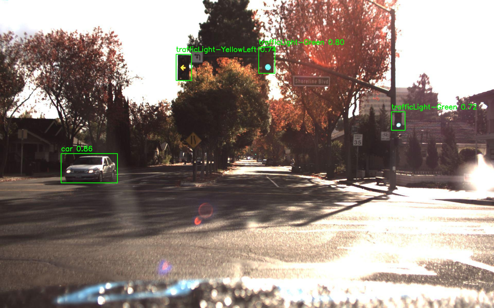
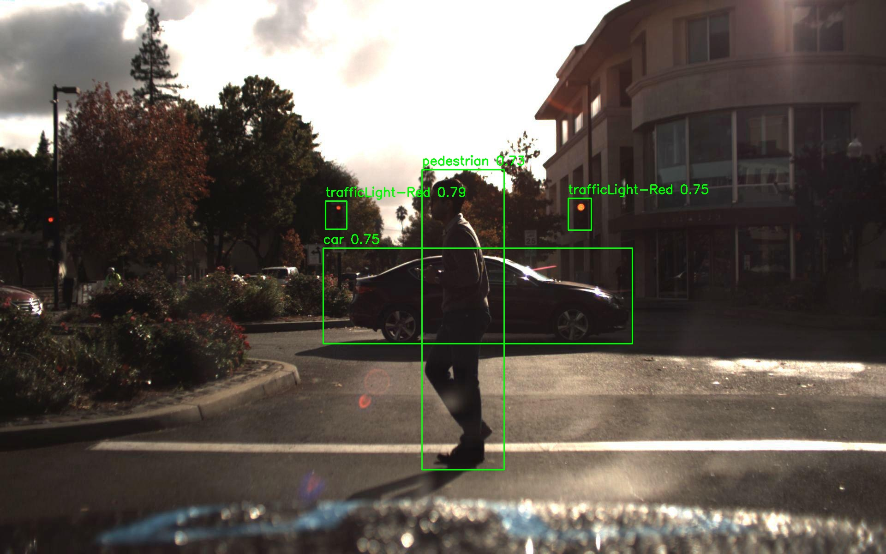
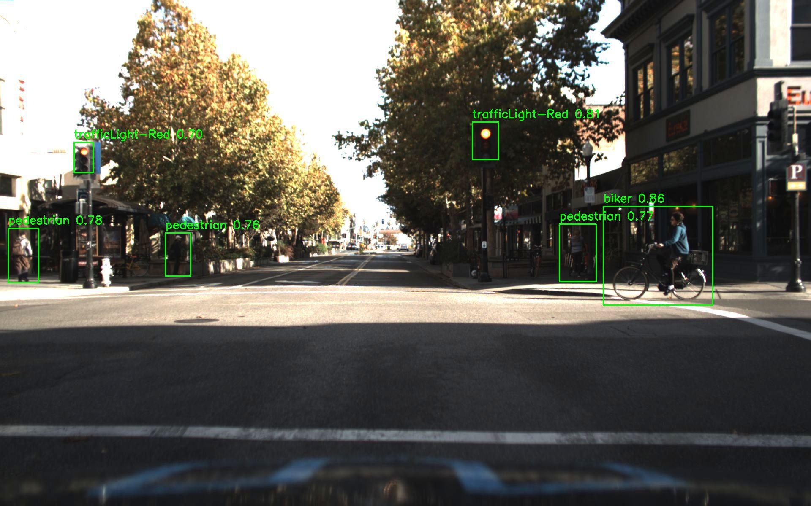
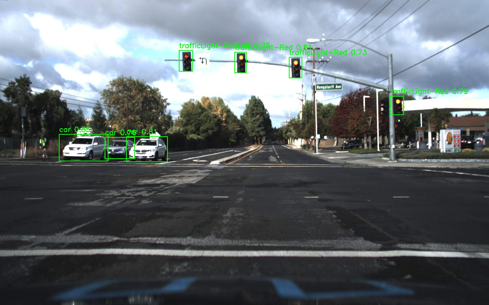
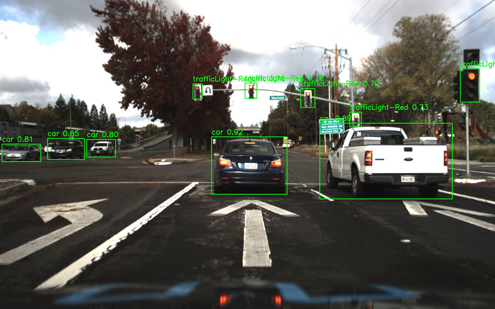

# Overview

This project focuses on training a computer vision model using YOLOv8 medium and its pre-trained weights. The dataset is sourced online and was originally created as an example of a self-driving car training set.

# Data Lables

Data labels and distribution is as shown below:

The image above clearly shows that some classes in the dataset are undersampled. To address the imbalance, undersampled classes re we will augmented.

# Training and Results

There were about 29,000 images in the training set and 6,000 images in the validation set. Due to the extensiveness of the dataset and the chosen model, Google Colaboratory was used to access an L4 GPU and overall higher resources. The model was trained for 25 epochs with a batch size of 16 and an early stopping patience of 10. An image size of 800x800 was chosen to balance fast training and detailes on images. The results are shown below:

The model achieved impressive results with balanced precision and recall, as well as an overall mAP@0.5 score of 0.86. The confusion matrix also indicates that the model performs well on unseen data. To demonstrate the model's performance on unseen data, some inference results are attached below.

# Inference

